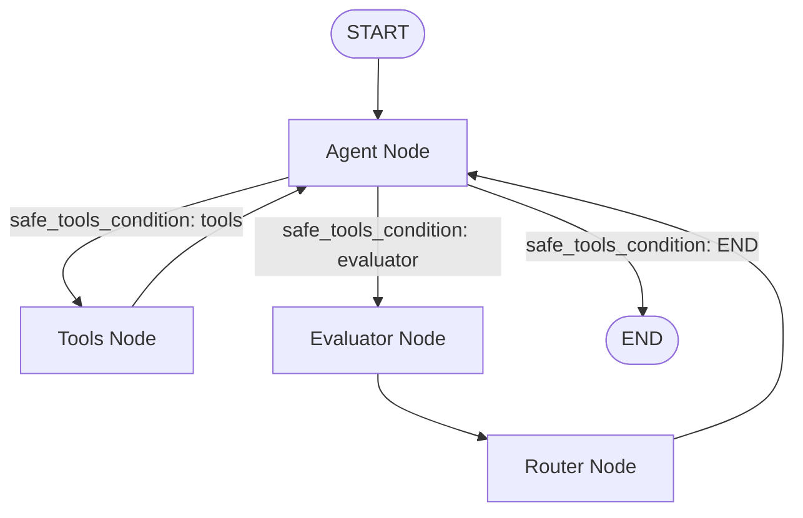

# SFLabs AI Assistant

This is an AI assistant with agents and LLM built with

- [Chainlit](https://docs.chainlit.io/)
- [Langchain](https://www.langchain.com/)
- [Langgraph](https://www.langchain.com/langgraph)
- [MCP](https://www.langchain.com/langgraph)

---

## 🧩 Requirements

- Python version, check this [file](./.python-version)
- AWS credentials with access to Bedrock and Claude models
- `.env` file with credentials, see [example](!.env.example)

---

## 📦 Setup

1. Clone the repo
2. Create and activate a virtual environment:
3. Install the modules
4. Run the app with chainlit

```bash
# optionally set and activate venv if required
uv venv
source .venv/bin/activate  # On Windows: venv\Scripts\activate

uv sync
uv run chainlit run app.py -w
```

## Instructions to run Grafana mcp server

- We use Streamable HTTP Mode
- You must expose port 8000 using the -p flag.
- Use the following commands to run the server

```bash
docker pull mcp/grafana
docker run --rm -p 8000:8000 \
    -e GRAFANA_URL=<Your GRAFANA_URL> \
    -e GRAFANA_API_KEY=<Your GRAFANA_API_KEY> \
    mcp/grafana -t streamable-http
```

## Observability graph details


